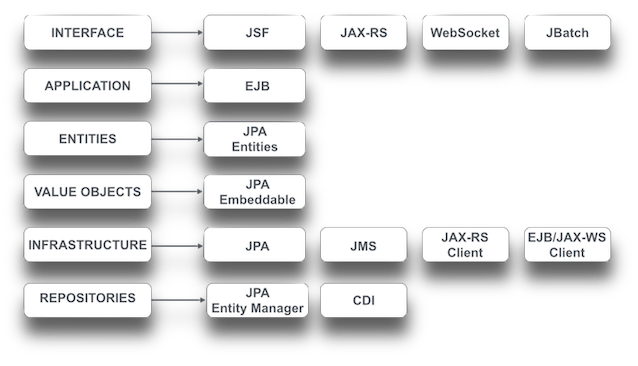

# Java EE and DDD

As the name implies, Domain-Driven Design is an approach to software design and development that focuses on the core domain and domain logic. The domain is implemented through a careful focus on traditional OOAD \(Object Oriented Analysis and Design\) and modeling the real world problem the software is trying to solve as closely as possible.

[Wikipedia](http://en.wikipedia.org/wiki/Domain-driven_design) does a surprisingly good job at overviewing DDD. Aslam Khan's [DDD Ref Card](http://refcardz.dzone.com/refcardz/getting-started-domain-driven) on DZone is a brief read and does a great job of explaining the core concepts of DDD. For a bit more detail, you could read the [free DDD eBook](http://www.infoq.com/minibooks/domain-driven-design-quickly) on InfoQ. Finally, you can of course read [Eric Evans' book](http://www.amazon.com/Domain-Driven-Design-Tackling-Complexity-Software/dp/0321125215) itself. However, we recommend not starting with the book until you get a bit of your bearings around this application first.

The basic building blocks of the domain are entities, value objects, aggregates, services, repositories and factories. The [Characterization](characterization.md) page overviews how these concepts are implemented in the application using Java EE. Logical layers partitioning distinct concerns are super-imposed on the core concept of the domain. These layers generally consist of the UI/interface layer, the application layer, the domain layer \(of course!\) and the infrastructure layer respectively. The [Layers](layers.md) page explains the architectural layers in the application and how they relate to various Java EE APIs. The DDD community also fully embraces practices like Test Driven Development, Agile, Emergent Design, Refactoring and Continuous Integration. We've incorporated all these practices into the application in a pragmatic fashion.

\(Diagram credited to \[Domain-Driven Design Quickly\]\(http://www.infoq.com/minibooks/domain-driven-design-quickly\)\)

One of the primary principles of DDD is that design should be focused on the business domain, not technology. The role of technology is to empower software developers to implement readable, productive, maintainable systems that mirror the real world, not place constraints on design choices. Most mainstream technology stacks today have matured enough to make this principle a reality, Java EE is no exception. In fact, with a single-minded focus on simplicity, POJOs, Java/OO centric strong typing, annotations and intelligent defaults that minimize system configuration and lets developers focus on solving the business problem, we think Java EE is one of the best platforms to support DDD. Java EE makes it possible to quickly and effectively produce a working system by annotating domain and application classes and implementing interface and infrastructure code. In the [Characterization](https://github.com/m-reza-rahman/cargo-tracker-documentation/tree/bcd07fa6d20b881de3413b61eef156244c305c38/javaee-ddd/,,/characterization/characterization.md) and [Layers](layers.md) pages we've overviewed how some key Java EE APIs map to DDD concepts and pointed you to some of the most important bits of implementation code in the application. In the figure below, we've summarized how this mapping looks like visually as a handy cross reference.

Note, the diagram above is most certainly not intended to be comprehensive. For example, besides JSF, JAX-RS, WebSocket and JBatch, some other technologies that are very useful in implementing interfaces are CDI \(for JSF backing beans\), Bean Validation, EJB \(e.g. remote or JMS messaging end-points\), JAX-WS \(SOAP end-points\) and JSON. Similarly, you can choose to implement application services as transactional CDI beans as opposed to EJB and you can use Interceptors, the low level JTA API and Java EE Concurrency Utilities in the application layer. Value Objects can be implemented as either JPA embeddables or entities. In addition to JPA, JMS, JAX-RS clients, JAX-WS clients and EJB clients it is very likely may use CDI, Bean Validation, JCA and WebSocket clients to implement infrastructure components. The point really is that Java EE APIs are there to help you implement elegantly designed systems as needed.

