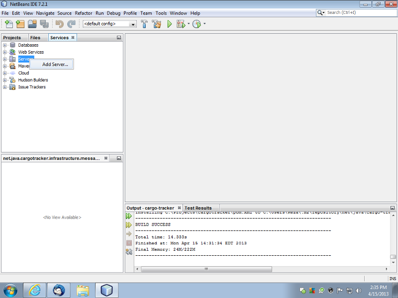
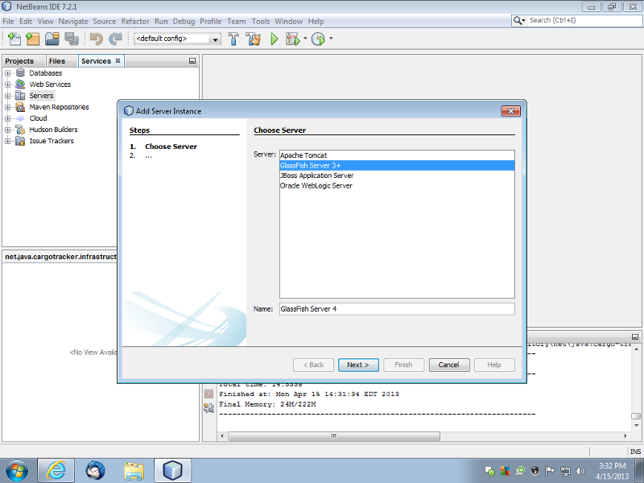
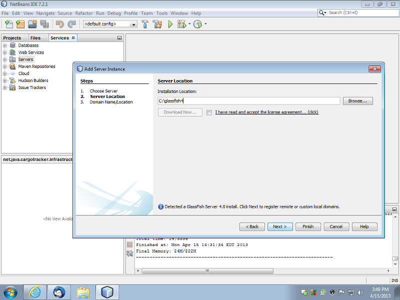
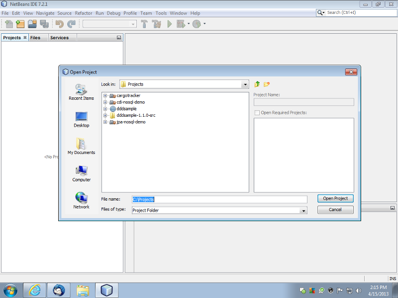
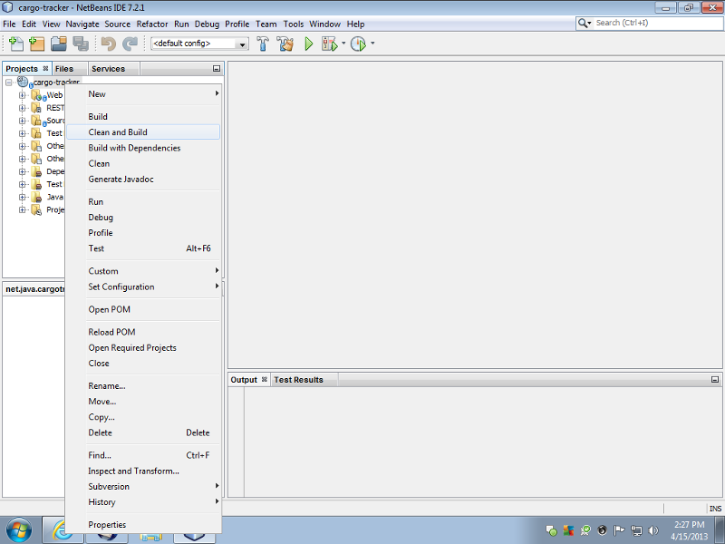
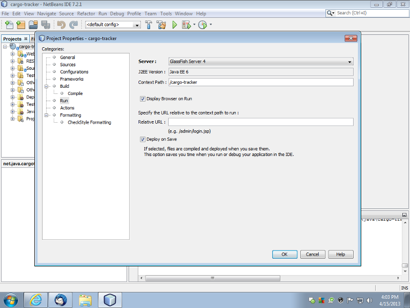
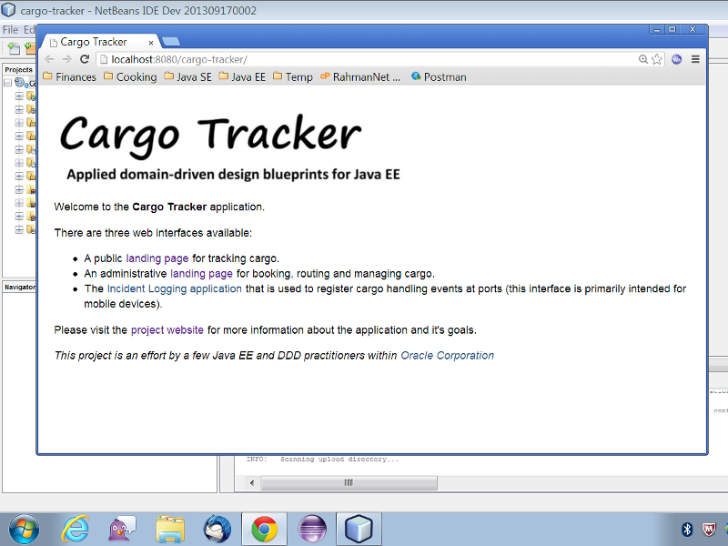

##Prerequisites

* JDK 8 or higher. You can download the JDK from [here] (http://www.oracle.com/technetwork/java/javase/downloads/index.html).
* GlassFish 4.1 (the application requires the full platform edition - the web profile edition won't be enough). Please note that we do not recommend using GlassFish 4.1.1 due to a number of bugs. You can download GlassFish 4.1 from [here] (https://glassfish.java.net/download-archive.html).
* NetBeans 8 or higher (NetBeans 8.1 recommended) - please make sure to use the Java EE edition of NetBeans. You can download NetBeans from [here] (https://netbeans.org/downloads/).

##Download

[Download](http://java.net/projects/cargotracker/downloads) the source code zip file and expand it somewhere in your file system, ideally into *'/Projects'*. Note that this is a Maven project. 

##NetBeans Setup

Start NetBeans, you will first need to configure GlassFish 4.x. Go in the *'Services'* tab, right click *'Servers'* and hit *'Add Server'*.

On the *'Add Server Instance'* dialog, choose GlassFish and give the instance a sensible name. Hit *'Next'*.

Point the *'Installation Location'* to where you have GlassFish 4.x installed on your file system. Hit *'Next'*. On the *'Domain Location'* screen, accept the defaults and hit *'Finish'*. 

Go to File->Open Project. Select the Cargo Tracker project from the file system and hit *'Open Project'*. NetBeans should recognize it as a Maven project on the file system. It may take a little bit to open and scan the project. 

After the project opens, immediately build it (you may be prompted to do a priming build, you can ignore the prompt). This will automatically download all the Maven dependencies. To build, right click on the project and hit *'Clean and Build'*. It may take a little bit for the project to build. 

After the project builds, you are now ready to run it.

You will now need to associate the Cargo Tracker project with GlassFish 4.x. To do this, right-click the project and select *'Properties'*. Then select *'Run'*. Select the GlassFish instance you just created as the *'Server'*, make sure the *'Context Path'* is set to *'/cargo-tracker'*, accept the rest of the defaults and hit *'OK'*. It might take a bit to save the project data. 

You are now ready to run the application. Right click on the project and hit *'Run'*. The first time startup might take a bit of time. After GlassFish starts, NetBeans should open up a browser window with the application. 

There is a tracking interface to track the current status of cargo and a booking interface to book and route cargo. You should explore both interfaces before diving into the code. You should also check out the [REST](https://java.net/projects/cargotracker/sources/svn/content/tags/1.0/src/main/java/net/java/cargotracker/interfaces/handling/rest/HandlingReportService.java) and [file processing](https://java.net/projects/cargotracker/sources/svn/content/tags/1.0/src/main/java/net/java/cargotracker/interfaces/handling/file/UploadDirectoryScanner.java) interfaces to register handling events as well as the HTML5/JavaScript client that uses the REST interface and targets mobile devices. You can test against the REST interfaces using our [soapUI tests](https://java.net/projects/cargotracker/sources/svn/show/tags/1.0/src/test/soapui).
